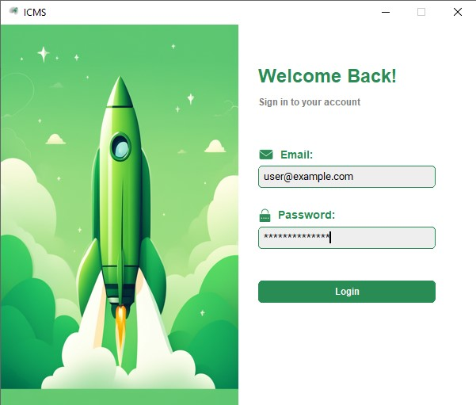
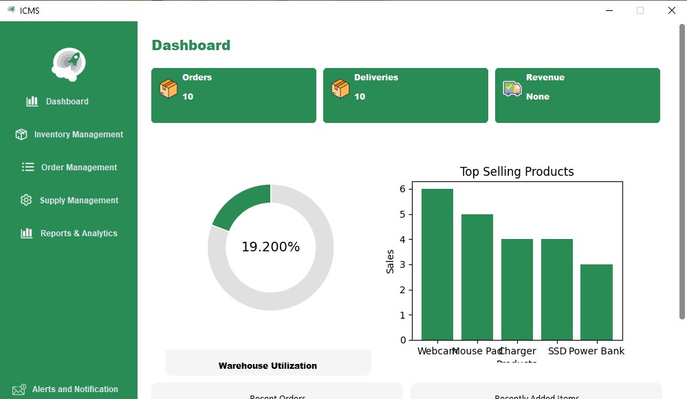
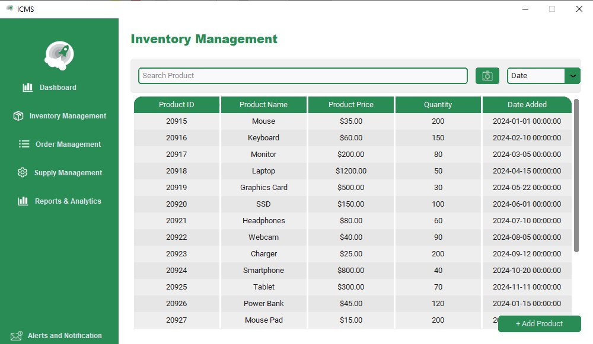

# Inventory Control Management System (ICMS)

## Description  
A desktop application for managing inventory efficiently. The ICMS offers features like stock tracking, order management, barcode scanning, and analytics, helping businesses optimize their inventory workflow.  

---

## Features  
- Inventory Tracking  
- Order Management  
- Barcode Generation and Scanning  
- Reports and Analytics (e.g., Revenue vs. Cost)  
- Supplier Performance Tracking  
- Alert System for Low Stock  
- Map Integration for Warehouse Product Location  

---

## Technologies Used  
- **Python** (Tkinter, CustomTkinter, matplotlib)  
- **MySQL** (for Database Management)  
- **PyZBar** (Barcode Scanning)  
- **Python Barcode** (Barcode Generation)  

---

## Demo Screenshots  
Below are some screenshots of the application in action: 

### Login  
  

### Dashboard  
  

### Inventory Management  
  

### Reports and Analytics  


### Alerts & Notfications 

---

## Installation and Setup  

### Prerequisites  
- Python 3.12.1  
- MySQL 8.0 

### Installation  
1. ### Clone the repository:

   ```bash
   git clone https://github.com/your-username/ICMS.git
   ```

2. ### Install the dependencies:

   ```bash
   pip install -r requirements.txt
   ```

3. ### Set up the MySQL database:  

   ### Step 1: Create a New MySQL Database

   Open your MySQL command line or any MySQL client tool and run the 
   following command to create a new database:

   ```bash
   CREATE DATABASE icms_db; 
   ```

   ### Step 2: Set Up Tables

   You have two options to set up your database tables:

   **Option 1: Run table.py to Create Tables**

   Make sure your MySQL server is running. Then, use the provided table.py                  
   script to create the required tables in the database.

   **Command:**

   ```bash
   python table.py   
   ```

   Ensure that table.py contains the correct credentials and logic to    
   connect to your icms\_db and create the necessary tables.

   **Option 2: Import an Existing SQL Schema**

   If you already have an SQL schema file or want to use the schema file    
   provided in the repository, use the following command to import it into    
   the database in mysql command line:

   ```bash
   mysql -u <username> -p icms_db < schema.sql      #replace <username> with your username
   ```

   ### Step 3: Verify the Setup

   After either running table.py or importing the schema, connect to the icms\_db database and verify that all tables are correctly created:

   ```bash
   USE icms_db;
   SHOW TABLES;   
   ```
4. ### Run the Application:
   Follow these steps to start and log in to your ICMS application:

   **Open Command Prompt:**

   - Navigate to the folder where the project is located:

   ```bash
   cd path/to/ICMS
   ```

   **Start the Application:**
   - Run the main Python file to launch the application:

   ```bash
   python main.py
   ```

   **Login Screen:**

   Once the login screen appears, enter the following credentials:

   - Username: admin                                                                         
   - Password: password123                                                                            

   (These are default credentials. Change them later for security.)

   **Navigate the Dashboard:**

   - Dashboard: View metrics like orders, deliveries, and revenue.
   - Inventory: Manage products by adding, updating, or removing items.
   - Orders: Create new orders and track existing ones.
   - Reports & Analytics: Get insights on supplier performance and product sales.

   **Closing the Application:**
   
   Simply close the window or stop the terminal process to exit the application.


## Usage

1. **Login:** Use admin credentials to log in.

2. **Dashboard:** View key metrics like orders, deliveries, and revenue.

3. **Inventory:** Add, update, and manage products in stock.

4. **Orders:** Create new orders and track existing ones.

5. **Reports & Analytics:** Generate insights on supplier performance and product sales.

## Folder Structure 

```bash
/ ICMS
├── __pycache__/               # Python cache files
├── img/                       # Folder for storing images
├── logic.py                   # Contains business logic or backend functions
├── main.py                    # Main entry point for the application
├── README.md                  # Documentation or project description
├── requirements.txt           # Lists dependencies and libraries for the project
├── table.py                   # Code related to table structures or management
```


## Future Improvements
  
- Implement user role management (e.g., Admin, Manager).  
- Add export functionality for reports (CSV, PDF).  
- Integrate email notifications for low stock alerts.  
- Mobile version for remote monitoring.  
- Cloud database integration for multi-location tracking.


## Credits  
- **[Tkinter Documentation](https://docs.python.org/3/library/tkinter.html)** - For GUI development guidelines.  
- **[MySQL Documentation](https://dev.mysql.com/doc/)** - For database management setup and queries.  
- **[PyZBar Documentation](https://pypi.org/project/pyzbar/)** - For barcode scanning functionality.  
- **[Python Barcode Library](https://pypi.org/project/python-barcode/)** - For generating barcodes.  
- **[Matplotlib Documentation](https://matplotlib.org/stable/users/index.html)** - For plotting graphs and charts.  
- **[CustomTkinter Documentation](https://customtkinter.tomschimansky.com/)** - For modern UI components in Python.  
- **[GitHub Guides](https://guides.github.com/)** - For version control and repository management.  
- **[Python MySQL Connector Documentation](https://dev.mysql.com/doc/connector-python/en/)** - For connecting the application with the MySQL database.  
- **[Stack Overflow](https://stackoverflow.com/)** - For troubleshooting and community support during development.


## 📧 Contact
For any issues or improvements, please feel free to reach out.      
[[saisaradhi802@gmail.com](https://mail.google.com/mail/?view=cm&fs=1&tf=1&to=saisaradhi802@gmail.com
)]
